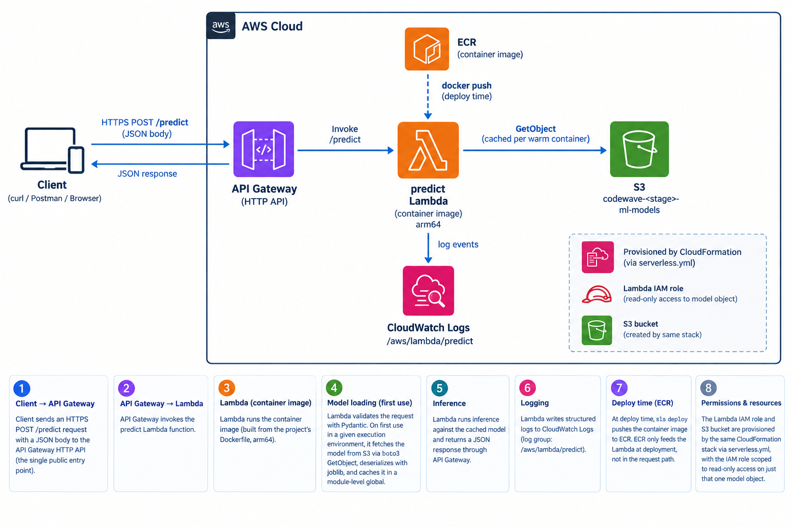

# Serverless - AWS Python Docker

This project has been generated using the `aws-nodejs-docker` template from the [Serverless framework](https://www.serverless.com/).

For detailed instructions, please refer to the [documentation](https://www.serverless.com/framework/docs/providers/aws/).

## Architecture



## Architecture Decision Records (ADR)

| # | Decision | Rationale |
|---|----------|-----------|
| 1 | Deploy as a **Lambda container image** (via ECR), not a zip package | Lets the function ship scikit-learn/pandas/boto3 without Lambda's zip size limits, and keeps the runtime environment fully reproducible via the Dockerfile. |
| 2 | Function **architecture: arm64** | Matches the platform the image is built on natively (Apple Silicon), and Graviton2 is generally cheaper/faster than x86_64 for equivalent workloads. |
| 3 | Trained model stored in **S3**, not baked into the image | Decouples the model's lifecycle from the code/image lifecycle — retraining and re-uploading a new model doesn't require a redeploy. The bucket (`codewave-<stage>-ml-models`) is provisioned via CloudFormation in `serverless.yml`; the object upload itself is a manual `aws s3 cp` step (see below), kept simple since this is a solo project. |
| 4 | Model is **loaded lazily inside the request path and cached in a module-level global** | Fetching S3 at import time would surface a transient S3 failure as an uncaught Lambda *Init* error outside our error handling. Loading on first invocation and caching afterward means the model is fetched once per warm container, and any load failure returns a clean `503` instead of a platform-level crash. |
| 5 | **Pydantic validates shape/types only**; unknown `model_year`/`origin` values are caught as a `ValueError` from the model itself (→ `422`), not hardcoded into the schema | The valid categories are training-time knowledge owned by the fitted `OneHotEncoder`. Duplicating them into the API schema would create two sources of truth that silently drift whenever the model is retrained. |
| 6 | `poetry install --no-root` / `package-mode = false` | This project is never pip-installed as a package — only its dependencies are needed inside the Lambda image — so package-mode adds no value and previously broke local `poetry install` (it referenced a nonexistent `packages` include). |

## Deployment instructions

> **Requirements**: Docker. In order to build images locally and push them to ECR, you need to have Docker installed on your local machine. Please refer to [official documentation](https://docs.docker.com/get-docker/).

In order to deploy your service, run the following command

```
sls deploy
```

This also creates the `codewave-<stage>-ml-models` S3 bucket via CloudFormation, but does **not** upload the trained model into it — that's a separate, manual step (see below).

## Upload the model to S3

After the first deploy (or whenever the model is retrained/re-exported from the notebook), upload the `.joblib` artifact to the bucket the stack created:

```
aws s3 cp scripts/mlr_mpg_v1.joblib \
  s3://codewave-dev-ml-models/models/mlr_mpg_v1.joblib \
  --profile codewave
```

Replace `dev` with the target stage if deploying elsewhere. The Lambda loads this object lazily on first invocation and caches it in memory for the life of the execution environment, so a redeploy (or waiting for the container to recycle) is needed to pick up a newly uploaded model.

## Test your service

After successful deployment and uploading the model, call the `/predict` endpoint:

```
curl -X POST https://<api-id>.execute-api.eu-west-1.amazonaws.com/predict \
  -H 'Content-Type: application/json' \
  -d '{"displacement":140,"horsepower":90,"weight":2264,"acceleration":15.5,"model_year":76,"origin":"usa"}'
```

or invoke it directly:

```
sls invoke --function predict --data '{"body": "{\"displacement\":140,\"horsepower\":90,\"weight\":2264,\"acceleration\":15.5,\"model_year\":76,\"origin\":\"usa\"}"}'
```
